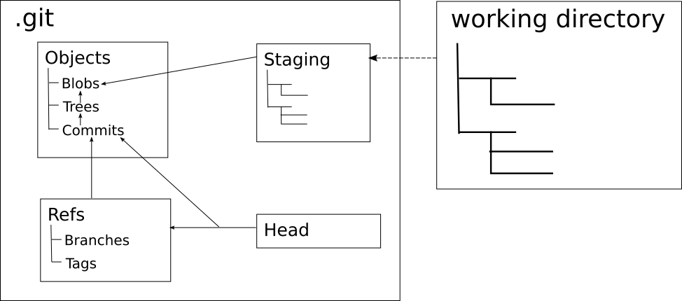

- title : git : under the covers
- description : A little insight into how git works
- author : Daniel Bradley
- theme : night
- transition : default

***

## git : under the covers

#### a little insight into how git works

<small>disclaimer: any gross oversimplifications or omissions are completely deliberate to avoid getting side-tracked</small>

' A little deeper
' Mental models
' Tips & tricks

***

## Anatomy of a Repo

' 1. Working copy/git repository
' 2. objects - commits, file trees, file snapshots (blobs) ...
' 3. refs - Branches (heads) & tags
' 4. HEAD - the parent of the next commit you create
' 6. index - (stage) shadow copy of the current working copy according to git

***

# Part 1

### Creating a repo

### ... the hard way

' porclain vs plumbing

---

### What's the point of refs?

How we find commits. Don't want to search every object

- heads: the names of our branches - move around
- tags: the names of our tags - stay in one place
- HEAD: where we're going to commit to

---

## The Graph

***
# Part 2

## git gymnastics

' Manipulating the graph
' Less low level
' Skipping merging

***

## Moving branches

---

## git reset

Changes a branch to point to a specific commit

| type    | branch | index | working dir |
|---------|--------|-------|-------------------|
| soft    | ✓      | ✗     | ✗                 |
| mixed   | ✓      | ✓     | ✗                 |
| hard    | ✓      | ✓     | ✓                 |

---

## git reset

1. Branch: point /.git/refs/heads/[branch] to new commit.
2. Index: Copy tree from commit to the index.
3. Working dir: Change content to match version in the index.

' Deleting all changes (same commit, --hard)
' Squashing commits on a branch (--soft)

***

## 'Moving' commits

### git cherry-pick

---

## git cherry-pick

- Parent changes ⇒ we change the hash.
- Old object not changed

---

_What if you've got 15 commits to move from one branch to another?_

***

## git rebase

    [lang=cs]
    for each commit in branch-a
      cherry-pick commit onto branch-b
    
    reset branch-a to new commit

---

## git rebase --interactive

***

# That's it

Hope that was enlightening in some way!

